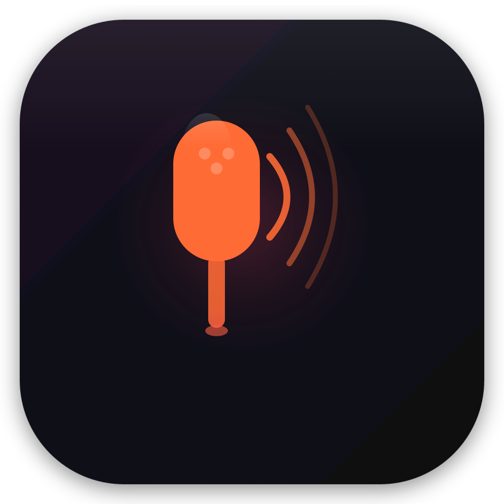
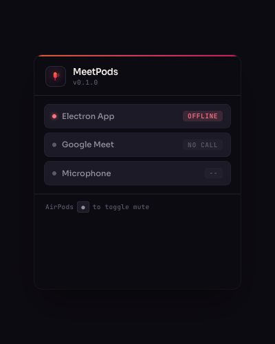

<p align="center">
  
</p>

<h1 align="center">MeetPods</h1>

<p align="center">
  <strong>Toggle Google Meet mute with your AirPods.</strong>
</p>

<p align="center">
  <a href="https://github.com/vinimlo/meetpods/actions/workflows/ci.yml"></a>
  
  
</p>

---

On iPhone, pressing the AirPods stem mutes and unmutes your call. On Mac, it just plays and pauses music. **MeetPods fixes this** — press your AirPods stem (or any media key) during a Google Meet call, and your microphone toggles. Outside of calls, media keys work normally.

<br />

<p align="center">
  
</p>

<br />

## Install

### Option A — Download the app

1. Grab the latest `.dmg` from [Releases](https://github.com/vinimlo/meetpods/releases)
2. Open it, drag MeetPods to **Applications**
3. Right-click → **Open** on first launch (the app is ad-hoc signed, not notarized)
4. Grant **Accessibility** and **Microphone** permissions when prompted
5. Install the Chrome extension — see [Extension setup](#chrome-extension) below

### Option B — Build from source

Requires macOS 12+, Node.js 22+, and Xcode Command Line Tools.

```bash
git clone https://github.com/vinimlo/meetpods.git
cd meetpods
make setup   # Install deps + full build
make dev     # Launch the app
```

To package your own `.dmg`:

```bash
make install   # Build .dmg and open installer
```

### Chrome extension

The Chrome extension connects to the menu bar app via local WebSocket and controls Google Meet's mute button.

1. Build the extension: `npm run build:ext`
2. Open `chrome://extensions/` in Google Chrome
3. Enable **Developer mode** (toggle in top-right)
4. Click **Load unpacked** → select the `dist/extension/` directory

> When installed from a `.dmg`, the extension files are bundled at `MeetPods.app/Contents/Resources/extension/`.

## How it works

```
AirPods stem press
  → macOS media key event
  → MeetPods intercepts via CGEventTap
  → Asks Chrome extension: "Active Meet call?"
  → Yes → Toggle mute, consume the key event
  → No  → Pass through (music plays/pauses normally)
```

Three components work together:

| Component | What it does |
| --- | --- |
| **Menu bar app** (Electron) | Intercepts media keys, orchestrates mute toggle, shows status in the menu bar |
| **Native addon** (C++/ObjC++) | Uses macOS `CGEventTap` to capture media key events at the system level |
| **Chrome extension** (Manifest V3) | Detects active Meet calls, clicks the mute button in the DOM |

The app also listens for **AirPods stem-hold mute gestures** via `AVAudioApplication` (macOS 14+), suppressing the "Cannot Control Mic" system notification.

### Menu bar states

| Icon | Meaning |
| --- | --- |
| Gray microphone | No active call — media keys pass through |
| Microphone + signal arcs | In call, mic on |
| Microphone with slash | In call, muted |

## Permissions

| Permission | Why |
| --- | --- |
| **Accessibility** | Intercept media key events via `CGEventTap` — same as Karabiner or BetterTouchTool |
| **Microphone** | Detect AirPods mute gestures and suppress the "Cannot Control Mic" notification (macOS 14+) |
| **Chrome: `tabs`** | Detect which tabs have Google Meet open |
| **Chrome: `meet.google.com`** | Inject content script to control the mute button |

## Development

See [CONTRIBUTING.md](CONTRIBUTING.md) for setup, architecture, and PR workflow.

**Quick reference:**

```bash
make help          # Show all targets
make dev           # Launch app (fast — skips native rebuild)
make test          # Run tests
make lint          # Lint code
make build         # Full build (TS + extension + native)
```

Detailed documentation lives in [`docs/`](docs/):

- [Architecture](docs/architecture.md) — full system design and data flow
- [Native addon](docs/native-addon.md) — CGEventTap, AUHAL, and Darwin notifications
- [Chrome extension](docs/chrome-extension.md) — Manifest V3, content scripts, WebSocket bridge
- [AirPods deep dive](docs/airpods-macos-deep-dive.md) — how AirPods events work on macOS

## Limitations

- **Google Meet only** — by design; MeetPods is a focused tool, not a universal mute switch
- **macOS only** — the native addon uses CoreGraphics and CoreAudio frameworks
- **Not on the Mac App Store** — Accessibility permission is not allowed in sandboxed apps
- **DOM-dependent** — Google Meet UI changes may require content script updates

## Security

See [SECURITY.md](SECURITY.md) for the security model and how to report vulnerabilities.

## Contributing

Contributions are welcome! See [CONTRIBUTING.md](CONTRIBUTING.md) to get started.

## License

Apache License 2.0 — see [LICENSE](LICENSE) for details.
